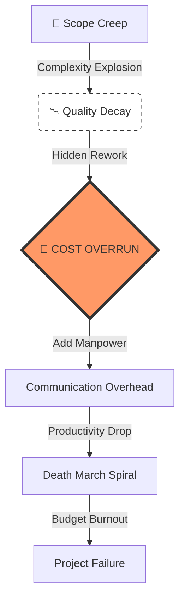

# 💸 DX Project Financial Risk Simulator
**技術的負債・仕様変更による「プロジェクト赤字」を可視化する財務シミュレーター**

[](https://dx-project-failure-structure-nl4ewadvnnug5haxtsfa2u.streamlit.app/)


<br>


---

## 📌 Executive Summary
**"Detecting the point of no return before the budget burns out."**

多くのDXプロジェクトが失敗する原因は、技術的な問題ではなく、**「見えない手戻りコスト（Hidden Rework Cost）」**と**「無秩序な仕様変更（Scope Creep）」**による財務的な破綻です。

本プロジェクトは、ブルックスの法則（Brooks' Law）やシステムダイナミクスを応用し、現場の「遅れ」が経営の「損失（円）」に変わるプロセスをリアルタイムで換算する**プロジェクト財務シミュレーター**です。

進捗率（%）という曖昧な指標ではなく、**「このままだと何月に予算が枯渇するか（Bankruptcy Date）」**を予測し、早期の損切りやスコープ調整を支援します。

---

## 🔍 Logic: The Structure of Failure



---

## 🎯 Business Use Cases (Governance)
本モデルは、PM（プロジェクトマネージャー）だけでなく、**「投資判断を行う経営層」**向けに設計されています。

* **Cost of Quality Visualization**
    * 投下した予算のうち、「価値を生んだ開発費」と「バグ修正で溶けた浪費（Waste）」の比率を可視化。
* **Stop-Loss Decision Support**
    * リカバリープラン（増員など）を実行した場合の最終着地見込み（EAC）を算出し、「撤退」か「続行」かの判断基準を提供。
* **Scope Creep Prevention**
    * 「ちょっとした追加要望」が、最終的にいくらの利益を圧迫するかを金額で提示し、安易な仕様変更を抑止。

---

## 🚀 Key Features

* **📊 Real-time Budget Burnup**
    * 初期予算と実績コスト（Actual Cost）の乖離を時系列で追跡。
* **💀 Death March Simulation**
    * ブルックスの法則を再現。「遅れているプロジェクトへの増員」が、教育コストによってさらに遅れを招く様子をシミュレート。
* **📉 Technical Debt Interest Rate**
    * リファクタリングを怠った場合の「品質負債」が、複利で開発速度を落とすメカニズムを実装。

---

## 📊 Outputs & Interpretation

| Output Metric | Description | Decision Making |
| :--- | :--- | :--- |
| **🚨 Bankruptcy Date** | 予算が枯渇する予測日 | リリース延期 / 予算追加の判断 |
| **💸 Total Deficit (Red Ink)** | 最終的な赤字着地見込額 | プロジェクト存続の可否判断 |
| **📉 Waste Ratio** | 手戻り・バグ修正に使われたコスト比率 | ベンダー/開発チームの品質監査 |

---

## 🔗 Related Tools

* **[⚖️ DX Project Risk Diagnostic](https://github.com/keisuke-data-lab/dx-risk-diagnostic)**
    * 過去の失敗事例（Mizuho, COCOA等）との構造類似性を判定するガバナンス診断ツール

---

## 💻 How to Run

> ⚠️ This is a prototype for financial risk estimation.

```bash
# 1. Clone the repository
git clone [https://github.com/keisuke-data-lab/dx-project-failure-structure.git](https://github.com/keisuke-data-lab/dx-project-failure-structure.git)

# 2. Install dependencies
pip install -r requirements.txt

# 3. Run the Financial Simulator
streamlit run app.py
```

<br>

<div align="center">
  Author: <b>Keisuke Nakamura</b><br>
  Project Finance / System Dynamics / Risk Modeling
</div>
