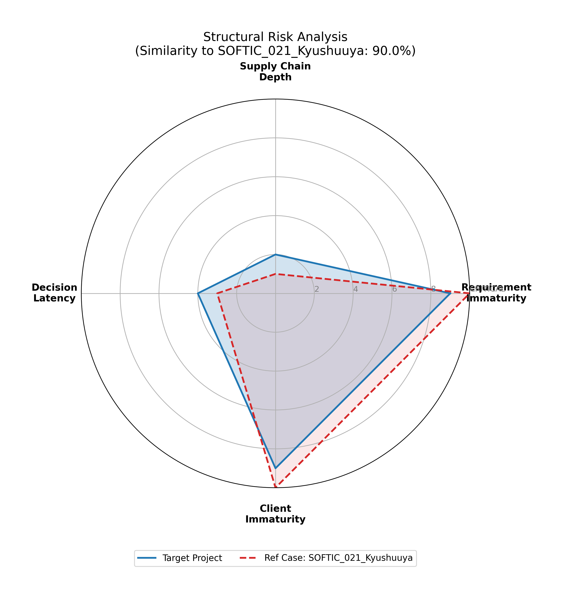

# DX Project Failure Structure Diagnostic
## (Project Omen) 過去の炎上・判例に基づく意思決定ストッパー

 

> **⚠️ 前提宣言 (Scope & Disclaimer)**
> 本リポジトリは、機械学習による高精度な予測モデルの構築を目的としたものではありません。
> 過去の日本のシステム開発における「構造的な失敗パターン（判例・炎上事例）」との類似性を判定し、**プロジェクト開始前の「損切り（Stop Loss）」や「体制見直し」を支援するためのガバナンス・ツール**です。
> 対象読者：CIO, DX推進責任者, PMO, 内部監査担当

---

## 1. Executive Summary（概要）

### 課題 (The Problem)
DXプロジェクトの失敗の多くは、技術的な難易度ではなく**「開始時点での構造的欠陥（要件の曖昧さ、意思決定の遅さ、発注者の当事者意識欠如）」**によって決定づけられています。しかし、多くの現場では「気合い」や「人員追加」という対症療法が選ばれ、結果として数億円規模のサンクコスト（埋没費用）が発生します。

### 解決策 (The Solution)
本ツールは、PMの「肌感覚」に依存していたリスク評価を、過去の**「死に至る病（失敗のDNA）」**との距離計算（事例ベース推論）によって定量化します。

### 提供価値 (Value Proposition)
「成功させる方法」ではなく、**「確実に失敗する構造」を検知して止める**こと。それが本ツールの唯一の目的です。

### Expected Outcome (導入効果)
* **Typical Outcome:** Early rejection or scope reset before 30–40% budget burn.
    （典型的な成果：予算の30-40%が溶ける前に、プロジェクトを早期凍結またはスコープ再設定する）

---

## 2. Risk Logic & Dataset（ロジックと変数）

本モデルは、過去の失敗事例を4つの構造的変数で定義し、診断対象プロジェクトとの**ユークリッド距離（類似度）**を算出します。

### Risk Variables (評価軸)
**Important Note:**
以下の変数はすべて**「リスク指数（Risk Index）」**です。スコアが高いほど「構造的リスクが高い（状態が悪い）」ことを示します。能力値（Capability）ではありません。

### Reference Dataset: "The Portfolio of Failure" (学習データ定義)
本ツールが参照する「失敗の類型」は以下の通りです。

| Variable (Code) | **Display Name (表示名)** | Why Critical? |
| :--- | :--- | :--- |
| `req_ambiguity` | **Requirement Immaturity** (要件定義の未熟度) | 「走りながら決める」は、法的紛争（SOFTIC 009）の入り口です。スコア高＝要件がカオス。 |
| `decision_speed` | **Decision Latency** (意思決定の遅延度) | 決まらないことは、間違った決定よりもプロジェクトを腐敗させます（Mizuho型）。 |
| `multi_vendor_layer` | **Supply Chain Depth** (多重下請け深度) | 責任の所在を曖昧にし、情報の伝達ロスと品質低下を招きます（COCOA型）。 |
| `user_incompetence` | **Client Immaturity** (発注者当事者能力の欠如) | **【最重要】** ベンダーが優秀でも、発注者が正確な情報を出せなければシステムは完成しません（九州屋型）。 |

| Case Name | Category (類型) | Root Cause (死因・教訓) |
| :--- | :--- | :--- |
| **みずほ銀行基幹システム開発** | Complexity Overload (複雑性の暴走) | **意思決定不全 (Decision Latency):** 複数ベンダーの利害調整に失敗し、仕様が統合されないままリリースを強行。 |
| **セブンイレブン_7pay開発** | Governance Fail (ガバナンス欠如) | **経営の無理解 (Client Immaturity):** セキュリティ（2段階認証）の欠如を経営層が認識せず、サービス開始直後に即死撤退。 |
| **新型コロナウイルス接触確認アプリ_COCOA** | Supply Chain Fragility (多重下請け) | **責任所在の蒸発 (Supply Chain Depth):** 再委託が繰り返され、テスト工程の責任者が不在化。バグが数ヶ月放置された。 |
| **JCB基幹システム開発** | Death March (ベンダー崩壊) | **要件の未決 (Req Immaturity):** 要件が決まらないまま開発に着手し、人海戦術（増員）で解決しようとして現場が崩壊。 |
| **SOFTIC 009** (タグ事件) | Scope Creep (要件肥大化) | **法的紛争 (Legal Dispute):** ユーザーが追加要望を繰り返し、要件を確定させなかったことによる債務不履行争い。 |
| **SOFTIC 021** (九州屋事件) | **User Competence Fail** (ユーザー過失) | **GIGO (Garbage In, Garbage Out):** ベンダーに過失はなかったが、ユーザーの提供情報が誤っていたためシステムが不適合。 |

### The "Kyushuuya" Paradox (SOFTIC 021)
特筆すべきは「九州屋事件」です。ベンダーに過失はなく、バグもありませんでしたが、**「ユーザー（発注者）の業務理解不足」**によりプロジェクトは失敗しました。本ツールは、この「ユーザー起因のリスク」を検知できる点が特徴です。

### Tech Note: Heuristic Approach
> The distance-to-similarity conversion (e.g., Euclidean distance logic) is intentionally heuristic.
> The purpose is relative structural comparison with past failure cases, not statistical prediction accuracy.

---

## 3. Practical Use Cases（活用シーン）

本ツールは、以下のような「意思決定の節目」での利用を想定しています。

1.  **投資委員会・役員会 (Gate Review)**
    * 新規DX案件の承認時、類似スコアが「Mizuho型」や「7pay型」に近い場合、予算承認を却下または保留する。
2.  **法務・契約審査 (Legal Audit)**
    * 「要件未決のまま準委任契約」を結ぼうとする案件に対し、SOFTIC事例との類似性を警告する。
3.  **炎上案件のトリアージ (Triage)**
    * 既に遅延しているプロジェクトに対し、「リカバリ可能」か「即時撤退（損切り）」かを客観データで判断する。

---

## 4. What this project does NOT do（やらないこと）

* **個人の能力評価:** 開発者個人のスキル不足を暴くものではありません。組織構造の欠陥を暴くものです。
* **成功の保証:** リスクスコアが低くても成功するとは限りません。しかし、スコアが高い場合は「ほぼ確実に失敗」します。
* **開発推進:** プロジェクトを前に進めるためのツールではありません。**「止める」ためのブレーキ**です。

---

## 5. Tech Stack

* **Algorithm:** Case-Based Reasoning (k-NN approach)
* **Language:** Python 3.9
* **Libraries:** Pandas, NumPy, Matplotlib

## 6. Output Sample
**診断結果の可視化（レーダーチャート）**
特定されたリスク構造（赤点線）と、対象プロジェクト（青実線）の形状比較。

---

> **Note to Readers:**
> もし、このREADMEや出力結果を見て「不快」あるいは「居心地の悪さ」を感じたならば、
> **その不快感は多くの場合、予算超過が表面化する数年前に、現場だけが感じていた「予兆」そのものです。**
> (In many failed projects, this discomfort appears years before the budget overrun becomes visible.)
