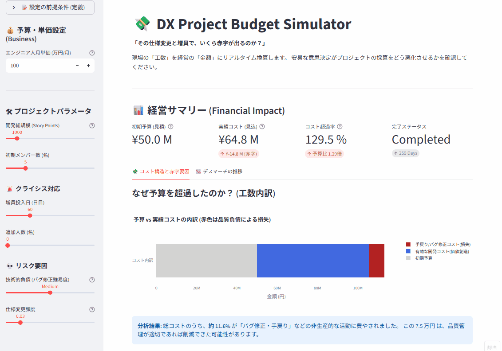

# DX Project Budget Simulator
**「仕様変更」と「手戻り」によるプロジェクト赤字を可視化する経営シミュレーター**
## 📸 Dashboard Demo
**▼ 実際のシミュレーション画面 (UI)**



## 📉 Business Value / Concept
**「離職は、コストではなく『負債』である。」**

本ツールは、組織内における**「離職の連鎖（Turnover Contagion）」**を確率モデルで再現し、人的資本投資のROIを算出する**人事戦略シミュレーター**です。

従来の「離職率」という静的な指標ではなく、欠員が残存社員（特にハイパフォーマー）に与える負荷と、そこから発生するドミノ倒し的な組織崩壊リスクを可視化します。

**【主な活用シーン】**
* **人的資本経営のROI証明:** 採用強化やリテンション施策への投資が、将来の「数億円規模の損失」を回避するために合理的であることを財務視点で証明する。
* **組織アラート:** 離職率がどの閾値を超えると、組織が自律回復不能な「崩壊フェーズ」に入るかを予見する。

[](https://dx-project-failure-structure-nl4ewadvnnug5haxtsfa2u.streamlit.app/)
> **👆 Click to Run App**: ブラウザ上で「なぜ予算超過が起きるのか？」を金額ベースで体験できます。

## 📌 Project Overview
**「遅れているプロジェクトへの増員は、赤字を拡大させるだけではないか？」**

本プロジェクトは、システム開発における「手戻り（Rework）」や「技術的負債」が、経営数値（予算・PL）に与えるインパクトを定量化するシミュレーターです。
現場の「工数遅れ」を経営の「損失額（円）」にリアルタイム換算し、**安易な意思決定がプロジェクトのROIをどのように破壊するか**を可視化します。

## 💰 Key Features (Biz Version)

### 1. リアルタイム予実管理 (Budget vs Actual)
エンジニアの人月単価設定に基づき、プロジェクト進行に伴う「累積コスト」と「初期予算」の乖離（赤字額）を算出します。
- **初期予算**: 見積もり規模(SP) × 単価
- **実績コスト**: (人件費 + 増員コスト + 教育コスト) × 経過日数

### 2. 品質コストの可視化 (Cost of Quality)
総コストを「価値を生んだ開発費（Value）」と「手戻り・バグ修正費（Waste）」に分解。
**「予算の30%がバグ修正で溶けている」** といった品質負債の財務インパクトを特定します。

### 3. デスマーチの構造分析 (Death March Dynamics)
- **増員の罠**: 人を追加した瞬間に教育コストで生産性が下がり、さらにコストカーブ（赤字）が急上昇する様子を再現。
- **仕様変更 (Scope Creep)**: 終わりのない仕様追加がどのように利益を圧迫するかをシミュレーション。

---

## 📊 Related Tool
**定性的な「プロジェクト構造リスク」を診断したい場合はこちら**
> **[⚖️ DX Project Risk Diagnostic (Project Omen)](https://github.com/keisuke-data-lab/dx-risk-diagnostic)**
> 過去の失敗事例（Mizuho, COCOA等）との類似性を判定するガバナンス診断ツール

---

## 📊 Related Tool
**定性的な「プロジェクト構造リスク」を診断したい場合はこちら**
> **[⚖️ DX Project Risk Diagnostic](https://github.com/keisuke-data-lab/dx-risk-diagnostic)**
> 過去の失敗事例（Mizuho, COCOA等）との類似性を判定するガバナンス診断ツール

---

## 🛠 Tech Stack
- **Language**: Python 3.12
- **Frontend**: Streamlit
- **Visualization**: Plotly (Interactive Charts)
- **Logic**: System Dynamics (Brooks' Law model)

### 📂 How to Run Locally

```bash
# 1. Install dependencies
pip install -r requirements.txt

# 2. Run application
streamlit run app.py
